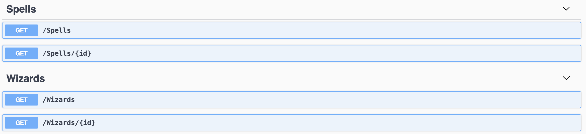

# PROYECTO HARRY POTTER SPELLS API
## Descripción
Esta API proporciona información sobre los hechizos de Harry Potter y permite agregar nuevos hechizos.

## Instalación
Para instalar la API, se debe clonar el repositorio y ejecutar el siguiente comando:
```bash
npm install
cp .env.example .env
```
## Ejecución
Para ejecutar la API, se debe ejecutar el siguiente comando:
```bash
npm run dev
```

## Uso

### Obtener hechizos
Para obtener todos los hechizos, se debe realizar una petición GET a la siguiente URL:
```bash
http://localhost:3000//harrypotter/Spells
```
Parámetros de consulta
| Parámetro | Descripción |
| --- | --- |
| Type | Tipo de hechizo (opcional) |
| light | Color de luz (opcional) |

Ejemplo:
```curl
curl -X GET http://localhost:3000/harrypotter/Spells?Type=Charm&light=Blue
```


### Agregar hechizo
Para agregar un hechizo, se debe realizar una petición POST a la siguiente URL:
```bash
http://localhost:3000/harrypotter/Spells
```

Cuerpo de la petición
| Campo | Descripción |
| --- | --- |
| name | Nombre del hechizo |
| incantation | Conjuro del hechizo |
| effect | Efecto del hechizo |
| canBeVerbal | Indica si el hechizo puede ser verbal | 
| type | Tipo de hechizo |
| light | Color de luz |
| creator | Creador del hechizo |

Ejemplo:
```curl
curl -X POST http://localhost:3000/harrypotter/Spells -d '{"name": "Expecto Patronum", "incantation": "Expecto Patronum", "effect": "Patronus", "canBeVerbal": true, "type": "Charm", "light": "Blue", "creator": "Albus Dumbledore"}' -H "Content-Type: application/json"
```

## Pruebas unitarias
Para ejecutar las pruebas unitarias, se debe ejecutar el siguiente comando:
```bash
npm run test
```

Para ejecutar las pruebas unitarias con cobertura, se debe ejecutar el siguiente comando:
```bash
npm run test:cov
```

Porceentaje de cobertura


## Consideraciones
- El filtro de light no esta funcionando en la API wizard-world-api

- La API no tiene un servicio para crear un hechizo



## Autor

- [Jhonatan Moreno Velasquez](www.linkedin.com/in/jhonatan-moreno-velasquez-252b07212)
